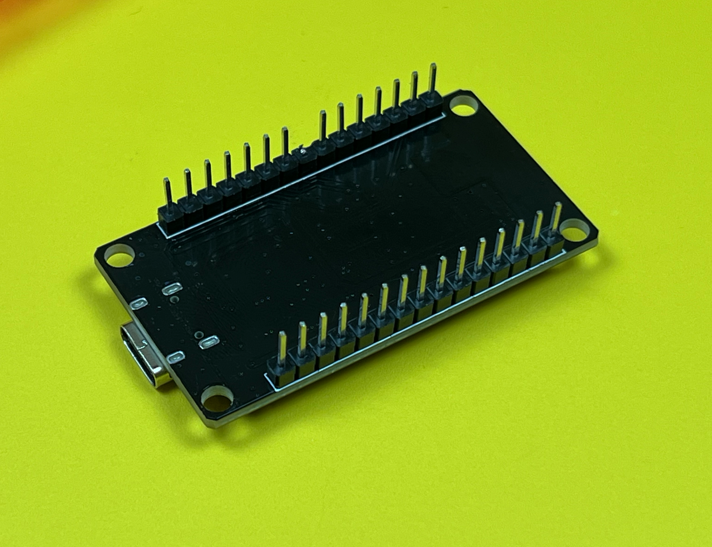

# How to Avoid Dominant Mode on Boot

In **RW** mode, hot-plugging the ESP32 with the shield causes the CAN transceiver to enter a dominant state (logical 0) during boot for up to 300ms. During this brief period, no devices on the CAN bus can transmit, and other CAN controllers may generate error frames or increase their error counters. However, once the ESP32 finishes booting, this issue resolves.

If you're using the ESP32 shield for troubleshooting and you power the ESP32 via USB before connecting it to the CAN bus/OBDII port while in RW mode, this modification is *not* required. Additionally, if you're only using it in **R** (read-only) mode, this mod is unnecessary.

To modify the device to prevent it from entering dominant mode when permanently connected to the OBDII port, follow the steps carefully. Only proceed if you're confident in what you're doing, as sending incorrect CAN messages or using buggy code can disrupt the CAN bus, potentially leading to undesirable consequences. While this modification is safe to perform, be cautious about what you write to the bus, and ensure you check your warranty and local regulations before proceeding.

<br>

**Disclaimer:** I am not responsible for any damages caused by following these instructions, including but not limited to damage to your vehicle, equipment, or any legal consequences that may arise. Proceed at your own risk and ensure you fully understand the potential impact of writing to a CAN bus before making any modifications.

<br><br>


<br>

## 1. Remove the Shield from the 3D Printed Case
Carefully open the 3D printed case and remove the shield to access the ESP32.


<br>

## 2. Unplug the ESP32 from the Shield
Carefully unplug the ESP32 from the shield to access the pin configuration for modification.


<br>

## 3. Cut the D5 Pin on the ESP32
- Locate the `D5 (GPIO5)` pin on the ESP32.
- Use a precision cutter to **cut the D5 pin** cleanly from the ESP32.



<br>

## 4. Solder a Wire Between D5 and D22 on the Shield
- Solder a **jumper wire** between the **D5 pin** and **D22 pin** on the shield.
- Make sure the wire is not shorting any other pins


<br>

## 5. Put Everything Back Together
- Plug the ESP32 back into the shield.
- Reassemble the 3D printed case and ensure everything is securely fitted.


<br>

## 6. Change the Code to Use GPIO22 for CAN TX Instead of GPIO5
Update your code to reflect the new TX pin assignment and upload it to the ESP32.

Before (sample code): 
```cpp
CAN.setPins(5, 4); 
```

After (sample code): 
```cpp
CAN.setPins(22, 4); 
```


By following these steps, the ESP32 will no longer enter dominant mode when connected to the OBDII port during boot. 