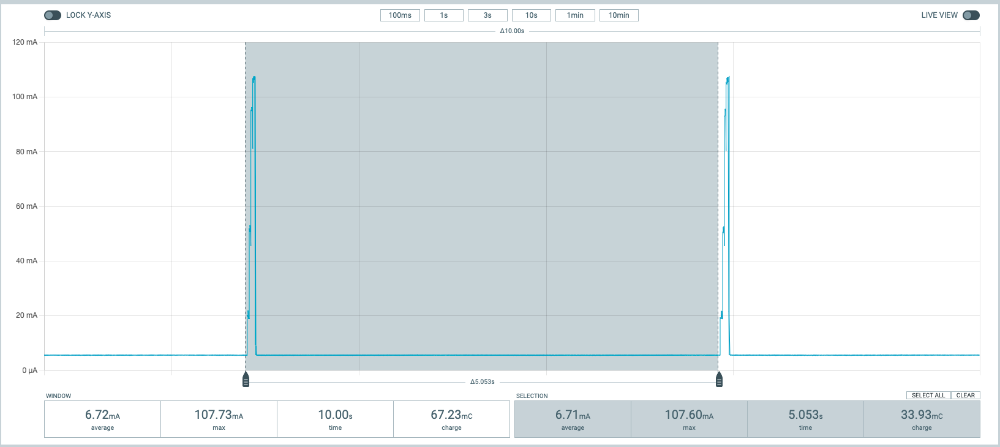

This project comprises a combination of software and hardware components designed to extract Controller Area Network (CAN) messages and generate practical gadgets. The primary objective is to receive CAN messages from a bus, extract the CAN-ID and Data from them, and subsequently transmit this information over ESPNow. The gadgets serve as ESPNow receivers, responsible for filtering and processing the received CAN-IDs and data to perform specific useful tasks.

## How to Install My Code

Certain firmware options (Gateway and Gadgets) can be conveniently installed online onto ESP32/ESP8266 devices with just a single click using the Chrome browser at <a href='https://mrdiyca.gitlab.io/mrdiy-esp-online-flasher'>https://mrdiyca.gitlab.io/mrdiy-esp-online-flasher</a>

## The Gateway / Bridge

The gateway, sometimes called the bridge, consists of an ESP32 Dev Kit 1 board paired with a CAN bus shield (see below), directly connected to the car's CAN bus, typically via the OBDII port. See my full video below.

Gateway = ESP32 + Shield

<table>
<tr>

<td>
Power consumption while active: <100mA 

</td>
<td>
While asleep w/o LEDs: <10 mA 

</td>

</tr>
</table>

## SavvyCAN

I got SavvyCAN to work on the gateway. More details: https://youtu.be/NDBkXGyBT88
 The source code is inside the /esp32_savvycan folder
 Online flasher at https://mrdiyca.gitlab.io/mrdiy-esp-online-flasher

## The Shield

Get the ESP32 <a href="https://store.mrdiy.ca/p/esp32-can-bus-shield/"> CAN Shield here.</a>

I designed a shield for the ESP32 Dev Kit 1 board [<a href='https://geni.us/jS2Lx1W'>Amazon</a>, <a href='https://s.click.aliexpress.com/e/_DmhOymx'>AliExpress</a>] that adds a CAN bus transceiver and steps down the car's battery voltage down to a usable 3.3v.

 **Version 1.0**: the original shield
 **Version 1.1**: added a voltage divider on GPIO32, a 120Ω CAN termination resistor, and a physical toggle switch enabling the CAN transceiver to toggle between “Listen-only” and “Do-Not-Transmit” modes.
 **Version 1.2 (current)**: added an OBD2 connector pinout, an extra LED on GPIO27, layout improvement, larger text, relocation of solder-jumpers to the top side, and the creation of a custom 3D printable case.

 

## The Gadgets

### Tesla Display

This gadget is a speedometer & battery SoC display screen for Tesla Model 3/Y.
 Online flasher at https://mrdiyca.gitlab.io/mrdiy-esp-online-flasher

### Garage door opener

This gadget waits for a signal from the car to trigger a relay to open or close a garage door. 
 The source code is inside the /gadget_garage_opener folder
 Online flasher at https://mrdiyca.gitlab.io/mrdiy-esp-online-flasher

### SLCAN/LAWICEL & SavvyCAN

This gadget converts the ESPNow CAN messages into SLCAN/LAWICEL format to allow it to be used with SavvyCAN for sniffing, monitoring, analyzing and decoding CAN messages. 
 The source code is inside the /gadget_savvycan folder
 Online flasher at https://mrdiyca.gitlab.io/mrdiy-esp-online-flasher

### Other Gadgets

coming soon ...

## License

This project is licensed under the Creative Commons Attribution-NonCommercial-ShareAlike 4.0 International License.