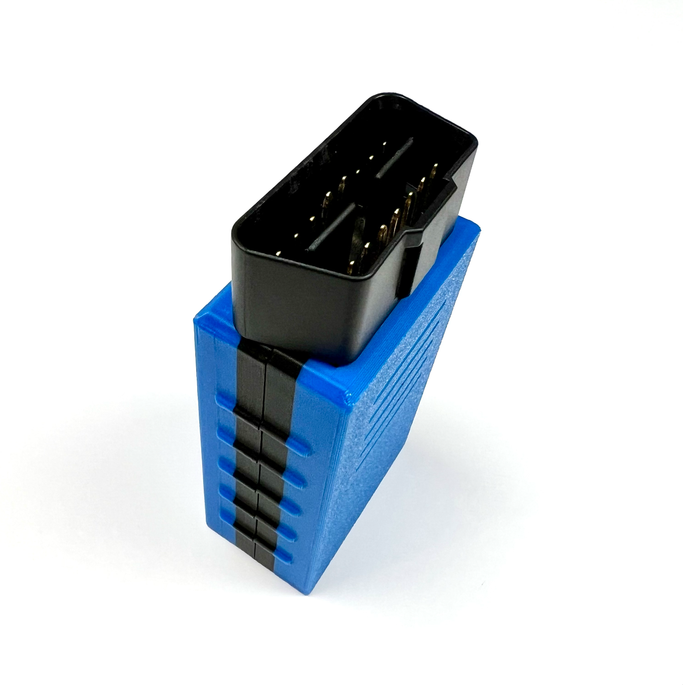

# Assembly Instruction

## 1. Parts You Need
- CAN Shield - https://store.mrdiy.ca/p/esp32-can-bus-shield/
- OBD2 Plug
- 2x 15 Pins Female Headers
- Soldering Iron
- Solder  

<u>**Pro Tip:**</u> The pins marked with white circles on the PCB are the ones in use. However, I recommend soldering all pins, including the unused ones, to maintain structural integrity.

## 2. Position the OBD2 Port
Ensure the OBD2 port is aligned at a **90-degree angle** to the shield.

## 3. Solder the OBD2 Port
- The OBD2 port should be placed **at the bottom** when looking at the shield from the top.
- Carefully solder all the pins.

## 4. Prepare the Female Headers
- Align the female headers properly.
- Note that the headers are also placed at the bottom, similar to the OBD2 port.

## 5. Solder the Female Headers
- **Pro Tip:** Insert an ESP32 DevKit1 into the headers to keep them in place while soldering.

- **Pro Tip:** Using a magnifier can help, but it's not necessary.

## 6. Attach the Enclosure
- Place the **bottom enclosure part** with the stands at the bottom.
- Place the assembled shield on top fot the enclosure as shown below.

## 7. Secure the Shield in Place
- Press down **slightly** until you hear a **click**. This is a tight-fit assembly.

## 8. Attach the Top Part of the Enclosure
- Align the **upper** enclosure part at an angle, starting from the bottom.

- Squeeze the top part gently with two fingers while pushing it down.

- Push down until it sits **securely**.

- **Pro Tip:** Lightly wiggle the top part until everything is properly aligned.

## 9. Fully Assembled CAN Shield
You now have a fully assembled CAN Shield device!

## Testing the Shield
You can visit my <a href="https://mrdiyca.gitlab.io/mrdiy-esp-online-flasher/" target="_blank">online flasher</a> and install the **"CAN Shield Tester"** to verify your soldering.

1. Once installed, **press the button** on the shield.
2. The **blue LED** should light up first, followed by the **green LED** after a second.
3. If both lights turn on, the soldering is correct.
4. If the blue or green light **does not** come on, double-check your soldering job.

## How the Test Works
- Pressing the button gets the ESP32 to set the CAN transceiver in **loopback**  mode.
- It sends a **CAN message** and waits for the same message to return.
- If the received message matches the sent message, the **green LED** turns on.
- This quick test verifies both **LEDs** and the **CAN transceiver** simultaneously.

Now you're ready to use your CAN Shield!